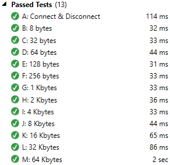

# SharpRUDP

 

Custom C# implementation of a Reliable UDP (RUDP) algorithm.

**Note:** Do you like this project? are you happily using it? then consider donating! I've spent almost 7 months developing this and counting, in both full-time and part-time ways. Your support keeps these high-quality projects alive! :)

## Intro

This project was born because I spent around 2 weeks working on a side project which required reliable UDP packet transmission, and the current options out there weren't up to the task. Why?

- **Codeplex RUDP:** It looks great, but too complicated for using it in a simple app.
- **Raknet:** The code is huge, and just reading the instructions to use it in C# gave me a headache.
- **Lidgren:** Hard to use with C#, it's also a C++ wrapper like Enet, and there's a lack of documentation too.
- **Enet:** Lack of documentation for the C# version. It's a wrapper to the C++ library. Hard to debug when used in C#.

I also tried to spin off my own RUDP implementation following the RFC and failing miserably. Those docs are very high-level, and the addendum made the pseudocode algorithm even harder to follow. So, I grew tired of all this and made my own algorithm...

## Usage

For a detailed (yet simple!) sample have a look at [PacketTest.cs](SharpRUDP/SharpRUDP.Test/Tests/PacketTest.cs) Run() method. Includes how to instantiate a server, listen for packets, instantiate a client and send packets. It's no big deal, it's made to be used easily without much fuss.

## Features

- Thread-safe.
- Channel-based communication.
- Keeps the connection alive using tiny keepalive packets.
- Retransmission of unacknowledged packets in the next send/reset iteration.
- Different serialization options (JSON and Binary. Binary is default, as it's WAY faster than JSON!)
- Packet data can be in JSON format, so the protocol can be ported to other languages (Node.js anyone?) without much issue.
- Pure concise, clean C# code. Avoids C++ wrappers and obscure BS. Most of the code is in **RUDPConnection.cs** and **RUDPChannel.cs** and they're < 700 lines long together!.
- Long data can be sent and will be retrieved sequentially, while keeping packet size to a safe MTU value (8Kb, since Android has 16Kb and Windows has 64Kb, safe spot is 8Kb). However, it will reserve 20% of that size for packet data just in case.

## Is it fast?

Well, I don't like to brag, but for sending and receiving 100 packets, splitting large packets into 8192 bytes (approx) each...

## About & License

Created by Alemar Osorio (DARKGuy).

This library is dual-licensed, you can either use it GPL or if you want to get money off an app using it, please contact me at darkguy2k8@gmail.com, I'm sure we can arrange something, I don't bite! :D
